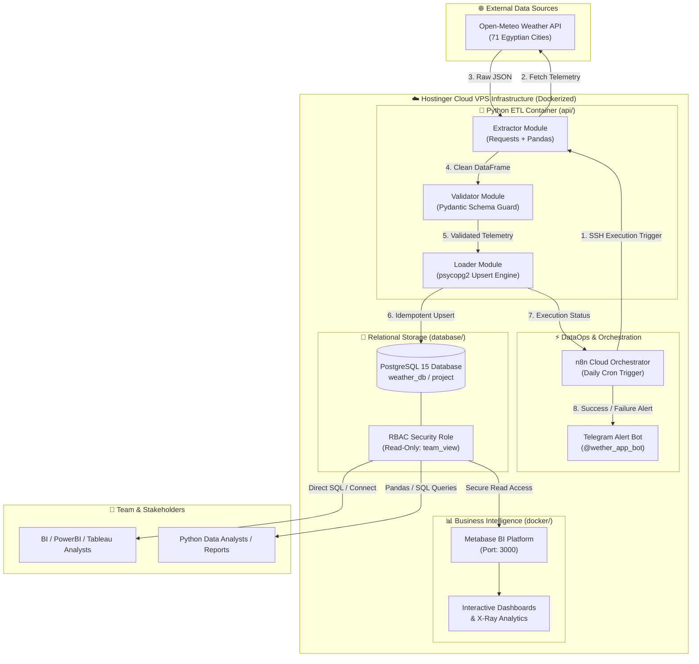

# 🌤️ Egypt Weather Data Engineering & BI Platform 🇪🇬

### Production-Grade End-to-End Data Pipeline, DevOps Infrastructure & Business Intelligence

**🎓 Graduation Project — Digital Egypt Pioneers Initiative (DEPI)**  
*Ministry of Communications and Information Technology (MCIT), Egypt — **Microsoft Data Engineer Track***


---

## 🧭 Repository Architecture & Directory Navigation

Welcome to the **Egypt Weather Data Engineering Platform**. To ensure high modularity and clean separation of concerns across our enterprise data engineering roles, the repository is organized into specialized domain directories. 

Click on any folder below to access its specific code, SQL schemas, Docker setups, or detailed documentation:

| Directory | Domain Role | Description | Key Contents |
| :--- | :--- | :--- | :--- |
| **[`📁 api/`](./api)** | 🐍 **Data Extraction & Quality** | Python ETL extraction engine that fetches real-time atmospheric telemetry from Open-Meteo API for 71 Egyptian cities with strict **Pydantic Guardrails**. | [`main.py`](./api/main.py), [`extractor.py`](./api/extractor.py), [`loader.py`](./api/loader.py), [`cities.json`](./api/cities.json) |
| **[`📁 database/`](./database)** | 🐘 **Database Architecture & SQL** | PostgreSQL relational storage architecture featuring idempotent upserts (`ON CONFLICT DO UPDATE`), analytical queries, and connection guides. | [`schema.sql`](./database/schema.sql), [`queries.sql`](./database/queries.sql), [`README.md`](./database/README.md) |
| **[`📁 docker/`](./docker)** | 🐳 **DevOps & Containerization** | Complete multi-container Docker ecosystem (`PostgreSQL`, `Python ETL`, `Metabase BI`) with one-click Windows management scripts. | [`docker-compose.yml`](./docker/docker-compose.yml), [`start_services.bat`](./docker/start_services.bat), [`README.md`](./docker/README.md) |
| **[`📁 n8n/`](./n8n)** | ⚡ **DataOps & Workflow Automation** | Autonomous daily cron workflow exported as JSON (`depi.json`) featuring SSH container execution triggers and instant Telegram Bot (`@wether_app_bot`) alerts. | [`depi.json`](./n8n/depi.json), [`README.md`](./n8n/README.md) |
| **[`📁 docs/`](./docs)** | 📚 **Comprehensive Documentation** | In-depth technical guides, step-by-step engineering stage breakdowns, cloud VPS deployment procedures, and future enhancement roadmaps. | [`README.md (Full English Docs)`](./docs/README.md), [`README_AR.md (Full Arabic Docs)`](./docs/README_AR.md), [`SERVER_UPDATE_GUIDE.md`](./docs/SERVER_UPDATE_GUIDE.md) |

---

## 3. System Architecture & Data Flow Overview



---

## 🌐 Live Production Demo & Public BI Dashboard

For instant evaluators' review without needing local installation, our complete **Metabase Business Intelligence Dashboard** is live and publicly accessible directly from our production **Hostinger Cloud VPS (`72.62.92.93:3000`)**:

👉 **[🔗 Click Here to Access the Live Interactive Weather BI Dashboard](http://72.62.92.93:3000/public/dashboard/ab63c544-c807-47da-a8c9-1490ce34f57b)**

* **Direct Public URL**: `http://72.62.92.93:3000/public/dashboard/ab63c544-c807-47da-a8c9-1490ce34f57b`
* **Features**: Interactive X-Ray visualizations, real-time temperature anomalies, wind/humidity distribution across 260 Egyptian cities, and automated telemetry tracking powered by read-only `PostgreSQL RBAC (`team_view`)`.
* **📲 Instant Mobile Scan (`QR Code`)**: Scan the barcode below with your phone camera to open the live dashboard directly without redirects:  
  [](http://72.62.92.93:3000/public/dashboard/ab63c544-c807-47da-a8c9-1490ce34f57b)

---

## 🚀 Quick Start Guide (Run Locally in 3 Steps)

Since all Docker configurations reside cleanly in the **[`docker/`](./docker)** folder, running the entire stack (`PostgreSQL + Python ETL + Metabase BI`) takes just one command:

### Option A: Using Windows One-Click Scripts (Easiest)
1. Navigate to the [`docker/`](./docker) directory.
2. Double-click **`start_services.bat`** (or execute `docker compose up -d` inside `docker/`).
3. Access **Metabase BI** at [`http://localhost:3000`](http://localhost:3000) and **PostgreSQL** at `localhost:5432`.

### Option B: Using Terminal CLI
```bash
# 1. Enter the docker configuration folder
cd docker

# 2. Launch all services in detached mode
docker compose up -d --build

# 3. Follow live weather ETL ingestion logs
docker compose logs -f weather-etl
```

---

## 👥 Enterprise Team Structure & Roles

| Role | Responsibility | Primary Directory & Code |
| :--- | :--- | :--- |
| 🐍 **1. Data Extraction & Quality Engineer** | Built the API ingestion engine (`cities.json`) & strict `Pydantic` schema guardrails. | [`api/`](./api) (`extractor.py`, `main.py`) |
| 🐘 **2. Database Architect & Load Engineer** | Designed PostgreSQL schema & idempotent `ON CONFLICT DO UPDATE` transactional loading. | [`database/`](./database) (`schema.sql`, `queries.sql`) |
| 🐳 **3. DevOps & Cloud Infrastructure Engineer** | Containerized the stack via Docker Compose and managed Hostinger VPS network bridges. | [`docker/`](./docker) (`docker-compose.yml`) |
| ⚡ **4. DataOps & Automation Engineer** | Configured n8n autonomous daily cron triggers via SSH & Telegram Bot notifications. | [`n8n/`](./n8n) (`depi.json`, `@wether_app_bot`) |
| 📊 **5. BI Developer & Data Governance Lead** | Built Metabase X-Ray visualizations & provisioned read-only RBAC roles (`team_view`). | [`docker/`](./docker) (`Metabase BI Port 3000`) |

---

## 📖 Deep-Dive Technical Documentation

For complete, detailed engineering explanations, schema diagrams, stage breakdowns, and server update manuals, please visit our **Comprehensive Documentation Hub**:
- **[📘 Full English Technical Documentation (330+ lines)](./docs/README.md)**
- **[📗 التوثيق التقني الشامل باللغة العربية (330+ سطر)](./docs/README_AR.md)**
- **[🚀 Cloud Server Update & Deployment Guide](./docs/SERVER_UPDATE_GUIDE.md)**
- **[🌟 Future Enhancements & Architecture Roadmap](./docs/FUTURE_ENHANCEMENTS_ROADMAP.md)**
