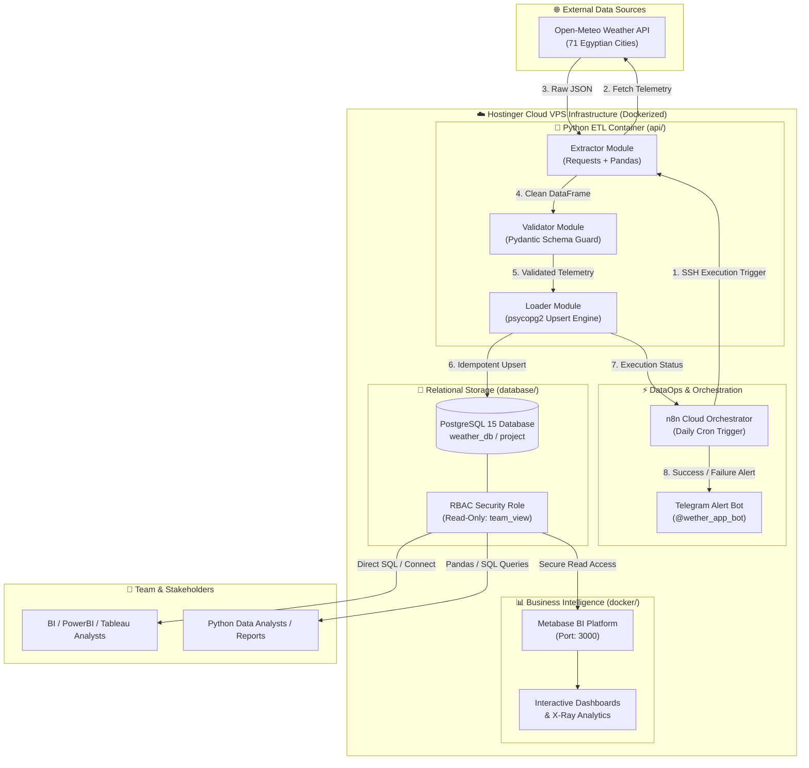

# 🌤️ منصة طقس مصر لهندسة البيانات وذكاء الأعمال 🇪🇬

### منظومة متكاملة لجمع، فحص، تخزين، وتحليل بيانات الطقس الحية بأعلى معايير الـ DataOps و DevOps

**🎓 مشروع التخرج النهائي — مبادرة رواد مصر الرقمية (DEPI)**  
*وزارة الاتصالات وتكنولوجيا المعلومات المصرية — **مسار Microsoft Data Engineer***


---

## 🧭 هندسة وتوزيع ملفات المشروع (`Repository Navigation & Architecture`)

أهلاً بك في **منصة هندسة بيانات طقس مصر**. لضمان أعلى معايير التنظيم والوضوح المتبع في الشركات والمشاريع الكبرى (`Clean Enterprise Architecture`) وتسهيل عمل أعضاء الفريق والمقيّمين (`Evaluators`)، تم تقسيم مستودع المشروع إلى مجلدات تخصصية دقيقة.

يمكنك الضغط على أي مجلد أدناه للوصول المباشر إلى الأكواد، أو استعلامات وقاعدة البيانات، أو إعدادات الدوكر، أو التوثيق الشامل:

| المجلد الرئيسي (`Directory`) | الدور ومجال العمل (`Domain Role`) | الوصف (`Description`) | أهم الملفات بداخل المجلد |
| :--- | :--- | :--- | :--- |
| **[`📁 api/`](./api)** | 🐍 **استخراج وفحص جودة البيانات** | محرك البايثون (`Python ETL`) المسؤول عن سحب الطقس اللحظي لـ 71 مدينة ومحافظة مصرية من واجهة Open-Meteo مع الفحص الصارم عبر **`Pydantic Guardrails`**. | [`main.py`](./api/main.py)، [`extractor.py`](./api/extractor.py)، [`loader.py`](./api/loader.py)، [`cities.json`](./api/cities.json) |
| **[`📁 database/`](./database)** | 🐘 **قواعد البيانات والاستعلامات** | طبقة التخزين العلائقي `PostgreSQL` وتتضمن تعريف الجداول والفهارس، وآلية الـ `Upsert` لمنع تكرار السجلات (`ON CONFLICT DO UPDATE`)، ودليل الاتصال المباشر من اللاب توب. | [`schema.sql`](./database/schema.sql)، [`queries.sql`](./database/queries.sql)، [`README.md`](./database/README.md) |
| **[`📁 docker/`](./docker)** | 🐳 **الدوكر والبنية التحتية (`DevOps`)** | منظومة الحاويات الشاملة (`PostgreSQL` + `Python ETL` + `Metabase BI`) المعرّفة في ملف الدوكر الموحد مع سكريبتات ويندوز جاهزة للتشغيل والإيقاف بضغطة زر. | [`docker-compose.yml`](./docker/docker-compose.yml)، [`start_services.bat`](./docker/start_services.bat)، [`README.md`](./docker/README.md) |
| **[`📁 n8n/`](./n8n)** | ⚡ **الأتمتة وجدولة التشغيل (`DataOps`)** | سير عمل الأتمتة التلقائي المُصدّر بصيغة JSON (`depi.json`) ويشمل تشغيل الحاويات عبر الـ SSH وإرسال التنبيهات اللحظية لبوت تليجرام (`@wether_app_bot`). | [`depi.json`](./n8n/depi.json)، [`README.md`](./n8n/README.md) |
| **[`📁 docs/`](./docs)** | 📚 **مركز التوثيق والأدلة الشاملة** | المجلد الذي يحتوي على كافة التفاصيل الهندسية العميقة للمشروع، وشرح المراحل الخمس، ودليل التحديث على السيرفر السحابي (`VPS`)، وخارطة طريق التطوير المستقبلي. | [`README_AR.md (التوثيق العربي الشامل)`](./docs/README_AR.md)، [`README.md (التوثيق الإنجليزي)`](./docs/README.md)، [`SERVER_UPDATE_GUIDE.md`](./docs/SERVER_UPDATE_GUIDE.md) |

---

## 🏗️ مخطط تدفق البيانات والمعمارية الهندسية (`System Architecture & Data Flow`)



---

## 🌐 المعاينة الحية المباشرة ورابط لوحة ذكاء الأعمال (`Live Public BI Dashboard`)

لتسهيل عمل لجنة التقييم والمناقشة وإتاحة الاطلاع الفوري على نتائج المشروع دون الحاجة لأي إعدادات أو تثبيت محلي، تم توفير رابط عام ومباشر للوحة ذكاء الأعمال (**`Metabase BI Dashboard`**) المستضافة على سيرفر الإنتاج السحابي الحقيقي (**`Hostinger Cloud VPS: 72.62.92.93:3000`**):

👉 **[🔗 اضغط هنا للدخول المباشر والتفاعل مع لوحة التحليلات الحية لطقس مصر](http://72.62.92.93:3000/public/dashboard/ab63c544-c807-47da-a8c9-1490ce34f57b)**

* **الرابط العام المباشر (`Public URL`)**: `http://72.62.92.93:3000/public/dashboard/ab63c544-c807-47da-a8c9-1490ce34f57b`
* **المميزات المتاحة للمقيّمين**: استعراض تفاعلي للرسوم البيانية (`X-Ray Visualizations`)، مقارنات درجات الحرارة والرطوبة وسرعة الرياح الحية لـ 260 مدينة ومحافظة مصرية، ومراقبة دورات السحب اليومية مع حماية البيانات عبر صلاحيات القراءة فقط (`PostgreSQL RBAC: team_view`).
* **📲 باركود المسح السريع بالهاتف (`QR Code`)**: يمكن للمقيّمين وأعضاء اللجنة مسح الباركود أدناه بكاميرا الهاتف للدخول الفوري على لوحة التحليلات الحية بدون أي وسيط أو إعلانات:  
  [](http://72.62.92.93:3000/public/dashboard/ab63c544-c807-47da-a8c9-1490ce34f57b)

---

## 🚀 دليل التشغيل السريع محلياً (`Quick Start - 3 Steps`)

بما أن جميع إعدادات وملفات الدوكر أصبحت منظمة داخل مجلد **[`docker/`](./docker)**، يمكنك تشغيل المنظومة بالكامل على جهازك بضغطة زر أو بأمر واحد:

### 🥇 الطريقة الأولى: باستخدام سكريبتات الويندوز التلقائية (الأسهل والأسرع)
1. ادخل إلى مجلد [`docker/`](./docker).
2. اضغط مرتين على ملف **`start_services.bat`**.
3. افتح متصفحك على الرابط [`http://localhost:3000`](http://localhost:3000) للدخول على لوحات **Metabase BI** التفاعلية، أو اتصل بقاعدة البيانات عبر المنفذ `5432`.

### 🥈 الطريقة الثانية: من سطر الأوامر (`Terminal CLI`)
```bash
# 1. الدخول لمجلد إعدادات الدوكر
cd docker

# 2. تشغيل كافة الحاويات في الخلفية
docker compose up -d --build

# 3. متابعة سجلات استخراج وتحميل بيانات الطقس حياً
docker compose logs -f weather-etl
```

---

## 👥 تقسيم أدوار الفريق ومسؤوليات مسار Microsoft Data Engineer

| الدور والمسمى الوظيفي | المسؤوليات والمخرجات الهندسية | المجلد والأكواد التابعة له |
| :--- | :--- | :--- |
| 🐍 **1. مهندس استخراج وفحص جودة البيانات** | بناء محرك جلب الطقس لـ 71 مدينة (`cities.json`) وتطبيق فحص الجودة الصارم عبر `Pydantic Guardrails` لرفض أي قراءة مشوهة. | [`api/`](./api) (`extractor.py`, `main.py`) |
| 🐘 **2. مهندس ومصمم قواعد البيانات** | تصميم جداول `PostgreSQL` وتنفيذ محرك التحميل التفاعلي الـ `Upsert` لمنع تكرار البيانات (`ON CONFLICT DO UPDATE`). | [`database/`](./database) (`schema.sql`, `queries.sql`) |
| 🐳 **3. مهندس البنية التحتية والدوكر (`DevOps`)** | تغليف جميع مكونات المشروع في حاويات دوكر وإدارة منافذ وشبكات السيرفر السحابي (`VPS Firewall`). | [`docker/`](./docker) (`docker-compose.yml`) |
| ⚡ **4. مهندس الأتمتة والمراقبة (`DataOps`)** | برمجة الجدولة اليومية الآلية باستخدام سحاب `n8n` وبناء بوت التنبيهات على تليجرام (`@wether_app_bot`). | [`n8n/`](./n8n) (`depi.json`، `@wether_app_bot`) |
| 📊 **5. مطور ذكاء الأعمال وحوكمة البيانات (`BI`)** | إعداد منصة `Metabase` وتصميم اللوحات التفاعلية مع إنشاء صلاحيات القراءة فقط (`RBAC Role: team_view`) لحماية البيانات. | [`docker/`](./docker) (`Metabase BI Port 3000`) |

---

## 📖 الدخول إلى مركز التوثيق التقني الشامل (`Deep-Dive Documentation Hub`)

للاطلاع على الشرح الهندسي المفصل لكل مرحلة، والأكواد الكاملة، وأدلة التحديث على السيرفر، وخارطة طريق التطوير، يرجى زيارة مركز التوثيق والمستندات الشامل:
- **[📗 التوثيق التقني والهندسي الشامل باللغة العربية (330+ سطر)](./docs/README_AR.md)**
- **[📘 Full English Technical Documentation (330+ lines)](./docs/README.md)**
- **[🚀 دليل التحديث وإضافة المدن الجديدة ورفعها للسيرفر السحابي](./docs/SERVER_UPDATE_GUIDE.md)**
- **[🌟 خارطة طريق التطوير وزيادة قيمة المشروع قبل المناقشة](./docs/FUTURE_ENHANCEMENTS_ROADMAP.md)**
